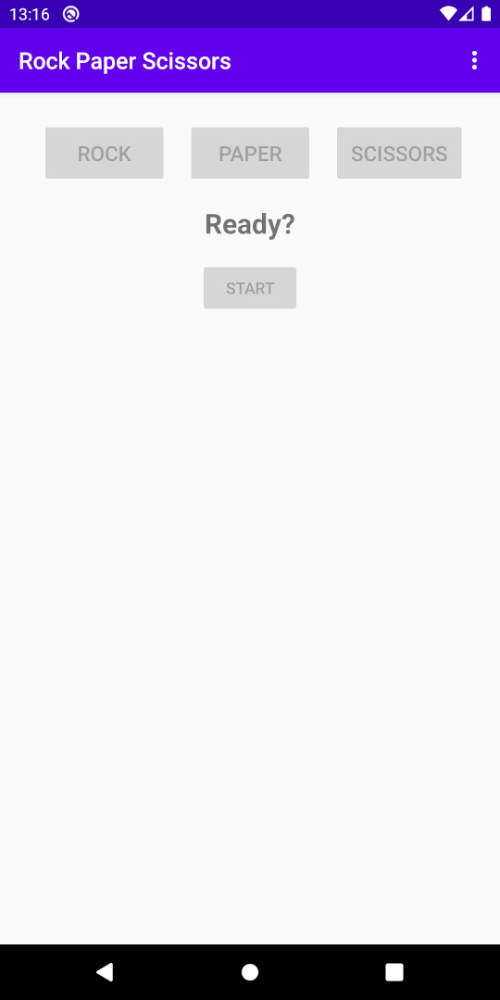

# Rock, Paper, Scissors Android app

This is an Android app written in Java for a Rock, Paper, Scissors game.

A player is playing against a computer/phone opponent.

After choosing the Start button, a countdown starts "Ready?, Rock, Paper, Scissors, Shoot"
Player 1 has a second to make a choice or they will be "Too Late"
Once the player has chosen Rock, Paper or Scissors, messages are displayed showing the computers choice and if there was a Win, Loss, or Tie

